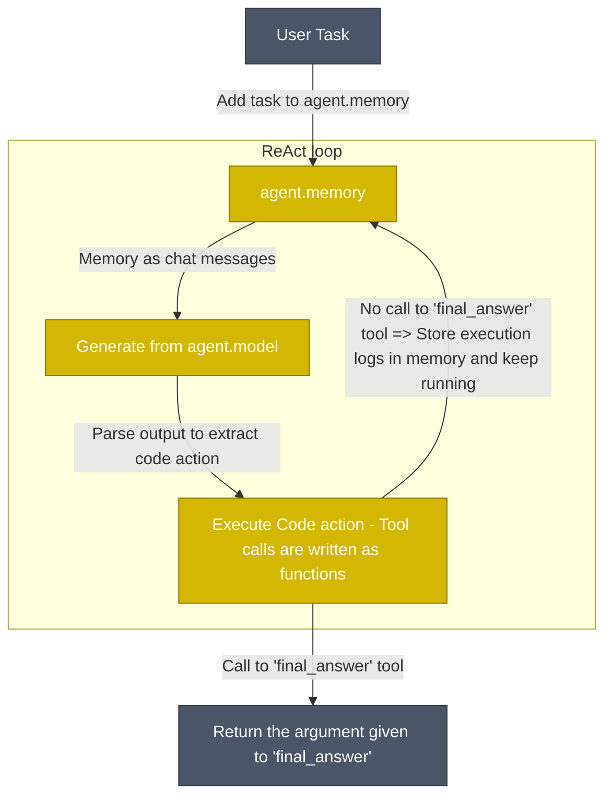

<!---
Copyright 2024 The HuggingFace Team. All rights reserved.

Licensed under the Apache License, Version 2.0 (the "License");
you may not use this file except in compliance with the License.
You may obtain a copy of the License at

    http://www.apache.org/licenses/LICENSE-2.0

Unless required by applicable law or agreed to in writing, software
distributed under the License is distributed on an "AS IS" BASIS,
WITHOUT WARRANTIES OR CONDITIONS OF ANY KIND, either express or implied.
See the License for the specific language governing permissions and
limitations under the License.
-->
<p align="center">
    <!-- Uncomment when CircleCI is set up
    <a href="https://circleci.com/gh/huggingface/accelerate"></a>
    -->
    <a href="https://github.com/huggingface/smolagents/blob/main/LICENSE"></a>
    <a href="https://huggingface.co/docs/smolagents"></a>
    <a href="https://github.com/huggingface/smolagents/releases"></a>
    <a href="https://github.com/huggingface/smolagents/blob/main/CODE_OF_CONDUCT.md"></a>
</p>

<h3 align="center">
  <div style="display:flex;flex-direction:row;">
    
    <p>Agents that think in code!</p>
  </div>
</h3>

`smolagents` is a library that enables you to run powerful agents in a few lines of code. It offers:

✨ **Simplicity**: the logic for agents fits in ~1,000 lines of code (see [agents.py](https://github.com/huggingface/smolagents/blob/main/src/smolagents/agents.py)). We kept abstractions to their minimal shape above raw code!

🧑‍💻 **First-class support for Code Agents**. Our [`CodeAgent`](https://huggingface.co/docs/smolagents/reference/agents#smolagents.CodeAgent) writes its actions in code (as opposed to "agents being used to write code"). To make it secure, we support executing in sandboxed environments via [E2B](https://e2b.dev/), [Modal](https://modal.com/), Docker, or Pyodide+Deno WebAssembly sandbox.

🤗 **Hub integrations**: you can [share/pull tools or agents to/from the Hub](https://huggingface.co/docs/smolagents/reference/tools#smolagents.Tool.from_hub) for instant sharing of the most efficient agents!

🌐 **Model-agnostic**: smolagents supports any LLM. It can be a local `transformers` or `ollama` model, one of [many providers on the Hub](https://huggingface.co/blog/inference-providers), or any model from OpenAI, Anthropic and many others via our [LiteLLM](https://www.litellm.ai/) integration.

👁️ **Modality-agnostic**: Agents support text, vision, video, even audio inputs! Cf [this tutorial](https://huggingface.co/docs/smolagents/examples/web_browser) for vision.

🛠️ **Tool-agnostic**: you can use tools from any [MCP server](https://huggingface.co/docs/smolagents/reference/tools#smolagents.ToolCollection.from_mcp), from [LangChain](https://huggingface.co/docs/smolagents/reference/tools#smolagents.Tool.from_langchain), you can even use a [Hub Space](https://huggingface.co/docs/smolagents/reference/tools#smolagents.Tool.from_space) as a tool.

Full documentation can be found [here](https://huggingface.co/docs/smolagents/index).

> [!NOTE]
> Check the our [launch blog post](https://huggingface.co/blog/smolagents) to learn more about `smolagents`!

## 🌲 扩展功能：树形多智能体 Rollout

本 fork 扩展了 smolagents，实现了树形多智能体推理系统，支持推理时的自一致性（Self-Consistency）和训练时的轨迹采样。

### 核心特性

**1. 三种分支模式**
- **Agent-level branching**: 起始点创建多个独立推理路径
- **Step-level branching**: 每步探索多个后续动作
- **层次化 Sub-agents**: 子智能体各自进行树形探索

**2. 应用场景**

**推理：Self-Consistency 提升准确率**
```python
from smolagents import BranchingCodeAgent, BranchConfig

agent = BranchingCodeAgent(
    tools=[...],
    model=model,
    branch_config=BranchConfig(mode='agent_level', n_branches=3),
    max_steps=5
)
# 生成 3 条独立推理路径 → 投票选择最优答案
```

**训练：轨迹采样提升样本多样性**
```python
agent = BranchingCodeAgent(
    tools=[...],
    model=model,
    branch_config=BranchConfig(mode='step_level', n_branches=3, branch_at_steps=2)
)
# 单个 prompt 生成 3^3 = 27 条不同轨迹，适用于 PPO/GRPO 训练
```

**多智能体协作**
```python
math_agent = BranchingCodeAgent(
    tools=[sympy_tools],
    branch_config=BranchConfig(mode='agent_level', n_branches=2)
)

main_agent = BranchingCodeAgent(
    managed_agents=[math_agent],
    branch_config=BranchConfig(mode='agent_level', n_branches=2)
)
# 嵌套树形结构：2 个主分支 × 2 个 math 结果 = 4 条完整路径
```


### 技术特点

- 完全异步并行执行（`anyio.create_task_group`）
- 内存高效（分支共享模型和工具）
- 完整的树形结构可视化（JSON + ASCII）
- 每分支独立 max_steps 控制

### 实现代码

实现位于 [`examples/agent_tree/`](./examples/agent_tree/)，包括：
- `simple_tree_demo.py` - 基础用法
- `async_math_solving_example.py` - 多智能体协作
- `tree_rollout_with_tracking.py` - 树形可视化

核心组件（~1200 行）：
- `BranchingCodeAgent`: 支持内存克隆的智能体
- `TreeRollout`: 异步编排器
- `CodeAgentTreeMemory`: 树形结构存储

---

### 生成的结构（部分）
树结构：
CodeAgent Tree:
└── Depth 0 [main_agent] TaskStep: "使用 math_agent 来解决以下问题:已知椭圆G: x²/2 + y² =..."
    └── Depth 1 [main_agent] ActionStep [ERROR]
        └── Depth 2 [main_agent] ActionStep [SUB-AGENT PENDING]
            ↳ Sub-agent tree:
              └── Depth 0 [math_agent] TaskStep: "已知椭圆方程: x²/2 + y² = 1, 焦点 F₁(-1,0).
直线 l..."
                  ├── Depth 1 [math_agent] ActionStep
                  │   └── Depth 2 [math_agent] ActionStep
                  │       └── Depth 3 [math_agent] ActionStep
                  │           └── Depth 4 [math_agent] ActionStep
                  │               └── Depth 5 [math_agent] ActionStep
                  │                   └── Depth 6 [math_agent] ActionStep
                  │                       └── Depth 7 [math_agent] ActionStep
                  │                           └── Depth 8 [math_agent] ActionStep
                  │                               └── Depth 9 [math_agent] ActionStep
                  │                                   └── Depth 10 [math_agent] ActionStep
                  │                                       └── Depth 11 [math_agent] ActionStep
                  │                                           └── Depth 12 [math_agent] ActionStep [FINAL: 经过详细验证，该推导过程**基本正确**，但存在一些细节需要...]
                  └── Depth 1 [math_agent] ActionStep
                      └── Depth 2 [math_agent] ActionStep
                          └── Depth 3 [math_agent] ActionStep
                              └── Depth 4 [math_agent] ActionStep
                                  └── Depth 5 [math_agent] ActionStep
                                      └── Depth 6 [math_agent] ActionStep
                                          └── Depth 7 [math_agent] ActionStep
                                              └── Depth 8 [math_agent] ActionStep
                                                  └── Depth 9 [math_agent] ActionStep
                                                      └── Depth 10 [math_agent] ActionStep
                                                          └── Depth 11 [math_agent] ActionStep
                                                              └── Depth 12 [math_agent] ActionStep [FINAL: 经过详细验证，该推导过程**基本正确**，但有一个小错误需要...]
            ├── Depth 3 [main_agent] ActionStep [FINAL: {'part_1': '-1/2', 'part_2': {...]
            └── Depth 3 [main_agent] ActionStep [FINAL: {'part_1': {'slope_of_OM': -0....]
Tree memory saved to: tree_rollout_outputs/tree_memory.json
Tree visualization saved to: tree_rollout_outputs/tree_visualization.txt

总共生成了 2 个 trajectories

Trajectory 1: 4 steps
  Saved to: tree_rollout_outputs/trajectory_1.json

Trajectory 2: 4 steps
  Saved to: tree_rollout_outputs/trajectory_2.json

Final answers from all trajectories: [{'part_1': '-1/2', 'part_2': {'exists': True, 'k_values': ['√2/2', '-√2/2'], 'line_equations': ['y = (√2/2)(x + 1)', 'y = (-√2/2)(x + 1)']}}, {'part_1': {'slope_of_OM': -0.5, 'explanation': '当直线l的斜率为1时，通过计算得到中点M的坐标为(-2/3, 1/3)，因此直线OM的斜率为(1/3)/(-2/3) = -1/2'}, 'part_2': {'exists': True, 'slopes': ['√2/2', '-√2/2'], 'equations': ['y = (√2/2)(x + 1)', 'y = (-√2/2)(x + 1)'], 'explanation': '通过代数推导和验证，存在两条满足|AM|² = |CM|·|DM|的直线，其斜率分别为√2/2和-√2/2，且都经过左焦点F₁(-1,0)'}}]

## Quick demo

First install the package with a default set of tools:
```bash
pip install "smolagents[toolkit]"
```
Then define your agent, give it the tools it needs and run it!
```py
from smolagents import CodeAgent, WebSearchTool, InferenceClientModel

model = InferenceClientModel()
agent = CodeAgent(tools=[WebSearchTool()], model=model, stream_outputs=True)

agent.run("How many seconds would it take for a leopard at full speed to run through Pont des Arts?")
```

https://github.com/user-attachments/assets/84b149b4-246c-40c9-a48d-ba013b08e600

You can even share your agent to the Hub, as a Space repository:
```py
agent.push_to_hub("m-ric/my_agent")

# agent.from_hub("m-ric/my_agent") to load an agent from Hub
```

Our library is LLM-agnostic: you could switch the example above to any inference provider.

<details>
<summary> <b>InferenceClientModel, gateway for all <a href="https://huggingface.co/docs/inference-providers/index">inference providers</a> supported on HF</b></summary>

```py
from smolagents import InferenceClientModel

model = InferenceClientModel(
    model_id="deepseek-ai/DeepSeek-R1",
    provider="together",
)
```
</details>
<details>
<summary> <b>LiteLLM to access 100+ LLMs</b></summary>

```py
from smolagents import LiteLLMModel

model = LiteLLMModel(
    model_id="anthropic/claude-3-5-sonnet-latest",
    temperature=0.2,
    api_key=os.environ["ANTHROPIC_API_KEY"]
)
```
</details>
<details>
<summary> <b>OpenAI-compatible servers: Together AI</b></summary>

```py
import os
from smolagents import OpenAIServerModel

model = OpenAIServerModel(
    model_id="deepseek-ai/DeepSeek-R1",
    api_base="https://api.together.xyz/v1/", # Leave this blank to query OpenAI servers.
    api_key=os.environ["TOGETHER_API_KEY"], # Switch to the API key for the server you're targeting.
)
```
</details>
<details>
<summary> <b>OpenAI-compatible servers: OpenRouter</b></summary>

```py
import os
from smolagents import OpenAIServerModel

model = OpenAIServerModel(
    model_id="openai/gpt-4o",
    api_base="https://openrouter.ai/api/v1", # Leave this blank to query OpenAI servers.
    api_key=os.environ["OPENROUTER_API_KEY"], # Switch to the API key for the server you're targeting.
)
```

</details>
<details>
<summary> <b>Local `transformers` model</b></summary>

```py
from smolagents import TransformersModel

model = TransformersModel(
    model_id="Qwen/Qwen2.5-Coder-32B-Instruct",
    max_new_tokens=4096,
    device_map="auto"
)
```
</details>
<details>
<summary> <b>Azure models</b></summary>

```py
import os
from smolagents import AzureOpenAIServerModel

model = AzureOpenAIServerModel(
    model_id = os.environ.get("AZURE_OPENAI_MODEL"),
    azure_endpoint=os.environ.get("AZURE_OPENAI_ENDPOINT"),
    api_key=os.environ.get("AZURE_OPENAI_API_KEY"),
    api_version=os.environ.get("OPENAI_API_VERSION")    
)
```
</details>
<details>
<summary> <b>Amazon Bedrock models</b></summary>

```py
import os
from smolagents import AmazonBedrockServerModel

model = AmazonBedrockServerModel(
    model_id = os.environ.get("AMAZON_BEDROCK_MODEL_ID") 
)
```
</details>

## CLI

You can run agents from CLI using two commands: `smolagent` and `webagent`.

`smolagent` is a generalist command to run a multi-step `CodeAgent` that can be equipped with various tools.

```bash
smolagent "Plan a trip to Tokyo, Kyoto and Osaka between Mar 28 and Apr 7."  --model-type "InferenceClientModel" --model-id "Qwen/Qwen2.5-Coder-32B-Instruct" --imports "pandas numpy" --tools "web_search"
```

Meanwhile `webagent` is a specific web-browsing agent using [helium](https://github.com/mherrmann/helium) (read more [here](https://github.com/huggingface/smolagents/blob/main/src/smolagents/vision_web_browser.py)).

For instance:
```bash
webagent "go to xyz.com/men, get to sale section, click the first clothing item you see. Get the product details, and the price, return them. note that I'm shopping from France" --model-type "LiteLLMModel" --model-id "gpt-4o"
```

## How do Code agents work?

Our [`CodeAgent`](https://huggingface.co/docs/smolagents/reference/agents#smolagents.CodeAgent) works mostly like classical ReAct agents - the exception being that the LLM engine writes its actions as Python code snippets.



Actions are now Python code snippets. Hence, tool calls will be performed as Python function calls. For instance, here is how the agent can perform web search over several websites in one single action:
```py
requests_to_search = ["gulf of mexico america", "greenland denmark", "tariffs"]
for request in requests_to_search:
    print(f"Here are the search results for {request}:", web_search(request))
```

Writing actions as code snippets is demonstrated to work better than the current industry practice of letting the LLM output a dictionary of the tools it wants to call: [uses 30% fewer steps](https://huggingface.co/papers/2402.01030) (thus 30% fewer LLM calls) and [reaches higher performance on difficult benchmarks](https://huggingface.co/papers/2411.01747). Head to [our high-level intro to agents](https://huggingface.co/docs/smolagents/conceptual_guides/intro_agents) to learn more on that.

Especially, since code execution can be a security concern (arbitrary code execution!), we provide options at runtime:
  - a secure python interpreter to run code more safely in your environment (more secure than raw code execution but still risky)
  - a sandboxed environment using [E2B](https://e2b.dev/) or Docker (removes the risk to your own system).

Alongside [`CodeAgent`](https://huggingface.co/docs/smolagents/reference/agents#smolagents.CodeAgent), we also provide the standard [`ToolCallingAgent`](https://huggingface.co/docs/smolagents/reference/agents#smolagents.ToolCallingAgent) which writes actions as JSON/text blobs. You can pick whichever style best suits your use case.

## How smol is this library?

We strived to keep abstractions to a strict minimum: the main code in `agents.py` has <1,000 lines of code.
Still, we implement several types of agents: `CodeAgent` writes its actions as Python code snippets, and the more classic `ToolCallingAgent` leverages built-in tool calling methods. We also have multi-agent hierarchies, import from tool collections, remote code execution, vision models...

By the way, why use a framework at all? Well, because a big part of this stuff is non-trivial. For instance, the code agent has to keep a consistent format for code throughout its system prompt, its parser, the execution. So our framework handles this complexity for you. But of course we still encourage you to hack into the source code and use only the bits that you need, to the exclusion of everything else!

## How strong are open models for agentic workflows?

We've created [`CodeAgent`](https://huggingface.co/docs/smolagents/reference/agents#smolagents.CodeAgent) instances with some leading models, and compared them on [this benchmark](https://huggingface.co/datasets/m-ric/agents_medium_benchmark_2) that gathers questions from a few different benchmarks to propose a varied blend of challenges.

[Find the benchmarking code here](https://github.com/huggingface/smolagents/blob/main/examples/smolagents_benchmark/run.py) for more detail on the agentic setup used, and see a comparison of using LLMs code agents compared to vanilla (spoilers: code agents works better).

<p align="center">
    
</p>

This comparison shows that open-source models can now take on the best closed models!

## Security

Security is a critical consideration when working with code-executing agents. Our library provides:
- Sandboxed execution options using [E2B](https://e2b.dev/), [Modal](https://modal.com/), Docker, or Pyodide+Deno WebAssembly sandbox
- Best practices for running agent code securely

For security policies, vulnerability reporting, and more information on secure agent execution, please see our [Security Policy](SECURITY.md).

## Contribute

Everyone is welcome to contribute, get started with our [contribution guide](https://github.com/huggingface/smolagents/blob/main/CONTRIBUTING.md).

## Cite smolagents

If you use `smolagents` in your publication, please cite it by using the following BibTeX entry.

```bibtex
@Misc{smolagents,
  title =        {`smolagents`: a smol library to build great agentic systems.},
  author =       {Aymeric Roucher and Albert Villanova del Moral and Thomas Wolf and Leandro von Werra and Erik Kaunismäki},
  howpublished = {\url{https://github.com/huggingface/smolagents}},
  year =         {2025}
}
```
